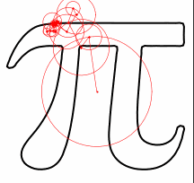

### Draw Circle Fourier

## Description
The aim of this project is to create a Python module that is able to draw an animation of any image, using Fourier series.

This is inspired by the [Fourier series circle drawings video by 3Blue1Brown](https://youtu.be/r6sGWTCMz2k?t=1000).

## Documentation 

Please read the the documentation of draw_circle_fourier for installation, usage and more, which is available [here](https://draw-fourier-circle.readthedocs.io/)

## Team members :
 * Burgat Paul, paul.burgat@etu.umontpellier.fr 
 * Cordoval Chloë, chloe.cordoval@etu.umontpellier.fr
 * Guillaumont Pierre, pierre.guillaumont@etu.umontpellier.fr
 * Koan Kenjy, kenjy.koan@etu.umontpellier.fr

## Video presentation

Our video presentation of this package is available [here](https://draw-fourier-circle.readthedocs.io/)

### Goal : 

The goal of our work is to achieve this result: 

https://user-images.githubusercontent.com/81428023/114725610-ec1f3980-9d3c-11eb-8dd7-d1697204f9df.mp4

From an image like the example of the horse :

