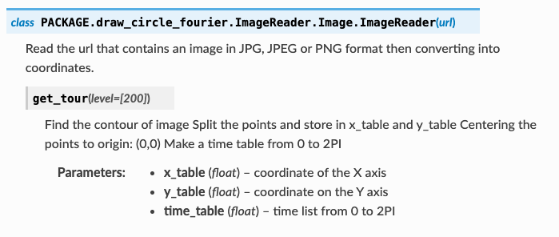

Image Manipulation
===================

A line drawing in a two dimensions space can be described mathematically as a parametric function, that is to say, two single variable functions such as : 

.. math::  f(t) = ( \, x(t) , y(t) \,) 

From a simple line drawing, a parametric path through the black pixels in that image can be found, and this path can be seperated into its :math:`x` and :math:`y` components.

The Fourier approximations of these two paths have to be calculated, and the coefficients have to be used from this approximation to determine the phase and amplitudes of the circles needed for the visualization. 

The main challenge to make something general is to create a list of points that, when joined, is as close as possible to the original image.

The beginning is pretty simple we import an image, read the image, and convert this image to black and white. Then, we extract the contour and using the 'get_tour function', we order the points such that joining them gives an image.

Important note on image selection:
^^^^^^^^^^^^^^^^^^^^^^^^^^^^^^^^^^^
For fast and clear drawings upload JPEG or PNG that are less than 50kb and can be made single path. It will be clear that your image cannot be made single path from the output, as the fourier transform will be applied to all paths.

The class methods
-------------------

.. autoclass:: PACKAGE.draw_circle_fourier.ImageReader.Image.ImageReader
   :members:

   
