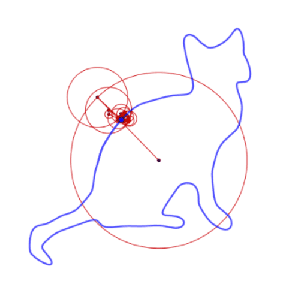

.. Fourier-Transform-Drawing documentation master file, created by
   sphinx-quickstart on Wed Apr 21 10:19:08 2021.
   You can adapt this file completely to your liking, but it should at least
   contain the root `toctree` directive.

Welcome to Fourier-Transform-Drawing's documentation!
=====================================================

.. toctree::
   :maxdepth: 2
   :caption: Contents:

   Page0
   Page1

   Caption text rendered below the image...

Indices and tables
==================

* :ref:`genindex`
* :ref:`modindex`
* :ref:`search`

